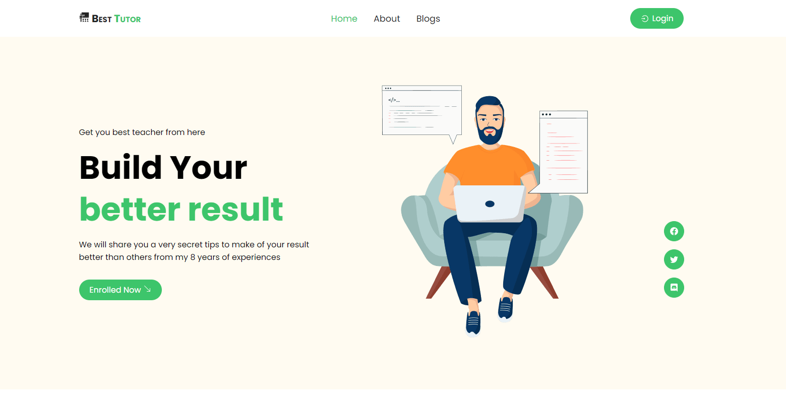

# Best Tutor on Internet

---

This is Home Tutor react web application here just previews home tutor services and can hire here of this particular tutor via this application as well.

---

## Using Technologies

- React Js Library
- React Router Dom for routing
- Firebase for Authentication
- React Hot Toast for fancy message
- React Styled Component
- React Swiper for sliding
- React Reveal Animation

## Required Features

- User Can Authenticate using Google, Github, Facebook as well
- User can see the details of services
- User also can create their own account write on form
- user also can get a awesome user experiences for animation and fancy kind of things
- user can see this application on their Mobile Phone because this is completely mobile responsive.
-

# Application link on <https://best-tutor-app.web.app/> OR [Click here to demo](https://best-tutor-app.web.app/)

## Preview Screenshot About this Project

> Thanks for reach out me on github.
